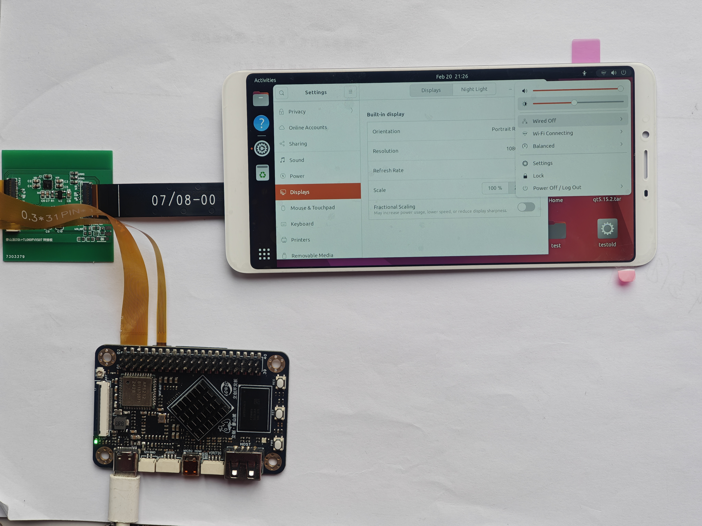

## 泰山派->TL060FVXS08 屏幕驱动板

This dtsi file fit TaishanPi & TIANMA TL060FVXS08 2160*1080 TFT-LCD & Samsung Touch

注意: 31pin 0.3mm /6pin 0.5mm fpc 排线均为反向！

## 内核修改步骤：
注意：本工程所使用的系统版本基于：https://github.com/CmST0us/tspi-linux-sdk

（1）将 tspi-rk3566-dsi-v10-天马6寸1080p屏幕.dtsi 中的内容复制到  tspi-linux-sdk/kernel/arch/arm64/boot/dts/rockchip/tspi-rk3566-dsi-v10.dtsi 中

（2）将 my_sec_ts 文件夹复制到 tspi-linux-sdk/kernel/drivers/input/touchscreen 中

（3）触摸屏驱动适配流程：

   在同目录下的 Makefile 文件中添加：

   > obj-$(CONFIG_TOUCHSCREEN_SEC_TS_1223)	+= my_sec_ts/
       
   在同目录下的Kconfig 的  if INPUT_TOUCHSCREEN 后添加  
       
   > source "drivers/input/touchscreen/my_sec_ts/Kconfig"

（4） 在/home/trumx/tspi-linux-sdk/kernel/arch/arm64/configs/panfrost.config中添加
   
   >CONFIG_TOUCHSCREEN_SEC_TS_1223=y

（5）编译，烧录
